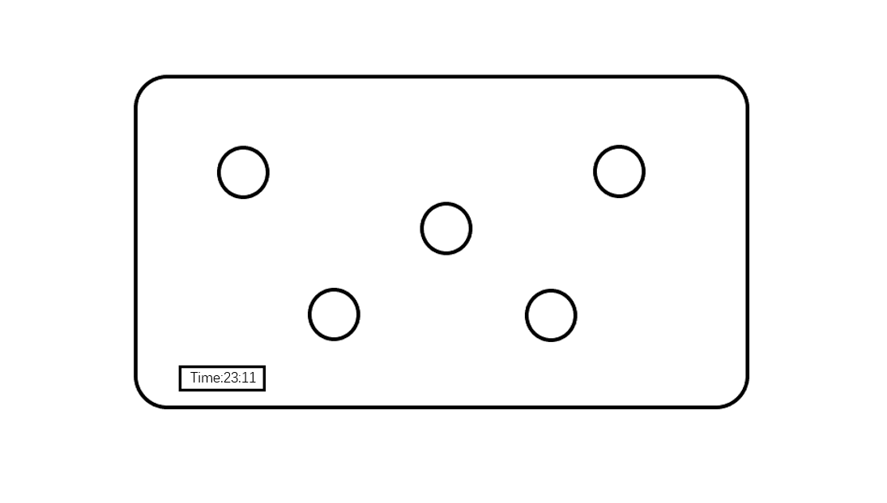
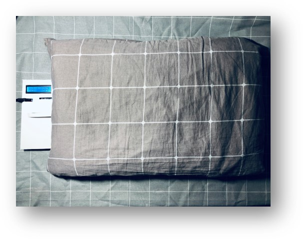
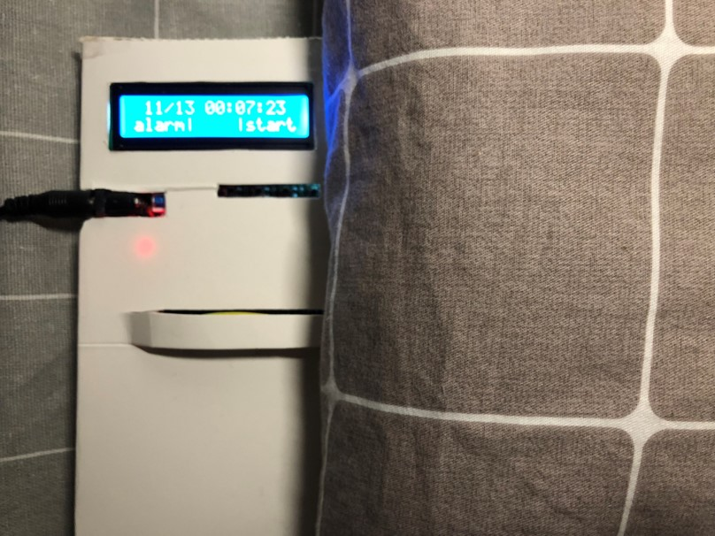
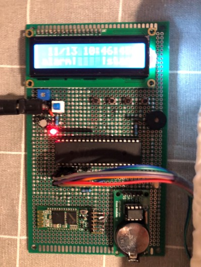
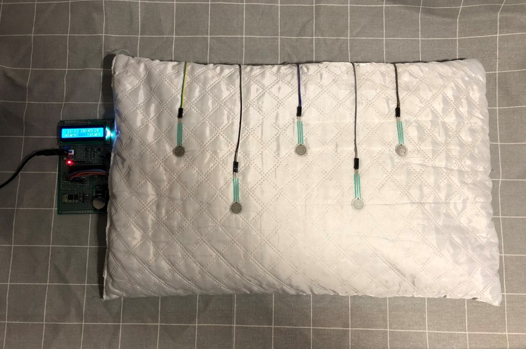
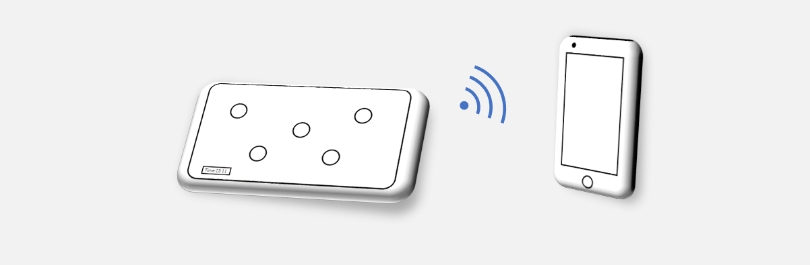
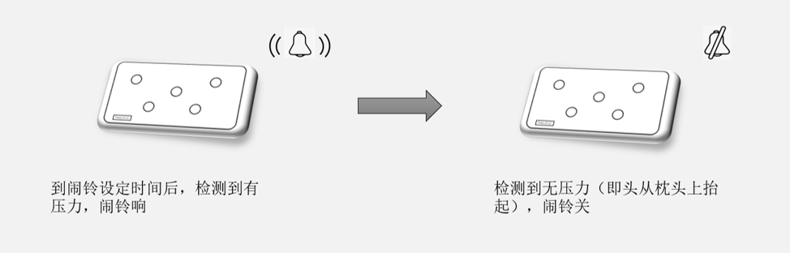

# 智能睡眠枕产品设计

>山东大学（威海）
>
>18级 数据科学与人工智能 孙易泽

项目中包含了产品商业计划书、产品代码、原理图及PCB图

## 产品简介

**智能睡眠枕**是一款帮助人们了解到自己睡眠状况，又配备了闹铃的枕头。它由**压力传感器、蓝牙传输模块、时钟模块、LCD模块，智能唤醒系统和单片机**组成。可以对人们夜晚睡眠状况进行记录和分析，并在浅睡眠阶段将用户唤醒。
<table>
    <tr>
        <td >
 
</td>
        <td >
 
</td>
        <td >
 
</td>
    </tr>
    <tr>
        <td>
产品概念图
</td>
        <td>
产品实物图
 </td>
        <td>
产品控制板
 </td>
    </tr>
</table>

以下是内部结构图：

<table>
    <tr>
        <td >
 
</td>
        <td >
 
</td>
    </tr>
    <tr>
        <td>
单片机图片
 </td>
        <td>
睡眠枕图片
 </td>
    </tr>
</table>

## 具体功能

+ 睡眠状况的记录和分析

  

  智能睡眠枕可以通过内置压力传感器，对用户进行睡眠监测。当用户躺在枕头上时，自动开始睡眠状态的记录。并可以在睡眠结束后，通过蓝牙传输模块将数据传输到手机，并进行数据的具体分析。它可以让人了解到每晚的睡眠时间、睡眠深度、离床次数等等，这有助于自身睡眠习惯的养成，我们可以利用此数据掌握自己的最佳就寝时间和睡眠时间。

+ 智能唤醒

  
  
  用户可设定每日的起床时间，并在设定时间的前半小时内，测量使用者所处的睡眠阶段，寻找最为合适的叫醒时间，并在浅睡眠阶段将使用者叫醒。这有利于生物钟的养成。当辅助到你的生物钟恢复调节睡眠机能，可以让你长时间保持这样的正常规律

## 产品竞争优势

+ 1.测量精准：智能睡眠枕内置5个压力传感器，形成压力传感器网络，可以随时并精准的对使用者睡觉时的动作和姿势进行监测。一旦检测到枕头所受头部压力的变化，都会及时的记录和储存下来，用于后期的睡眠分析。

+ 2.“自然醒”唤醒，符合人体生物钟规律：相比传统闹铃的定时叫醒，智能睡眠枕可以在设定闹铃时间的前半小时内，测量使用者所处的睡眠阶段，寻找最为合适的叫醒时间，并在浅睡眠阶段将使用者叫醒。这符合人体自然生物钟规律，并能帮助你长时间帮助你保持这样的规律，做到真正的“自然醒”。

+ 3.交互接口友好：可用移动电源供电，功耗低。并能通过低功耗蓝牙模块将数据传输至移动设备，随时随地的看到自己的睡眠情况。

+ 4.操作方便：五分钟之内就能学会对它进行熟练操作。